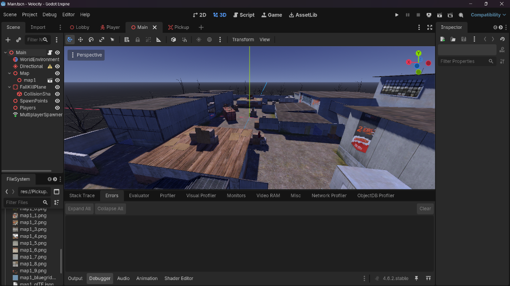
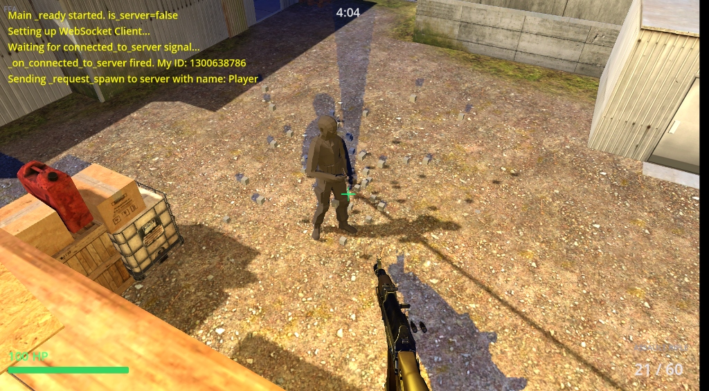
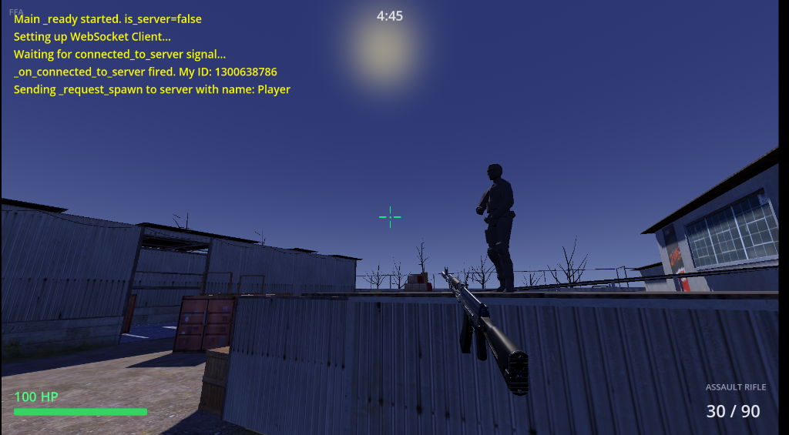
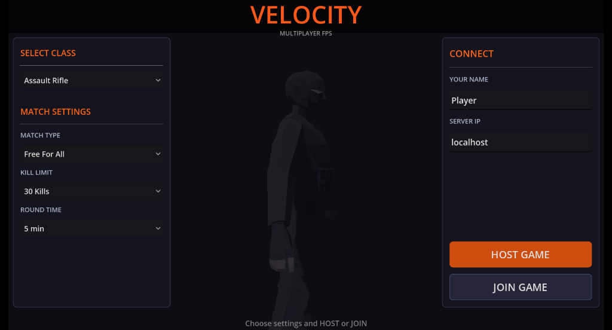
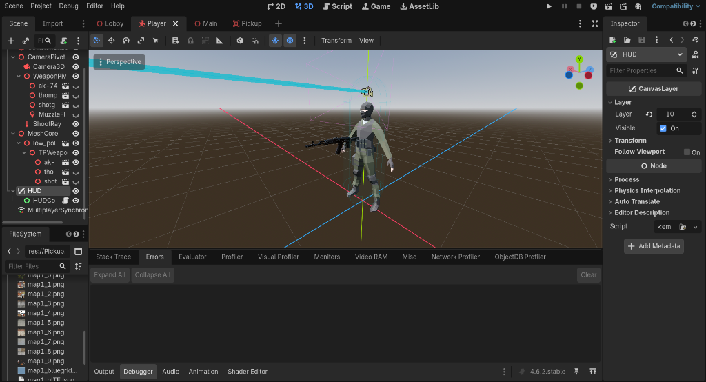

# 🎯 Evodot FPS
**Multiplayer First-Person Shooter in Godot 4**

Evodot is a robust, multiplayer First-Person Shooter game built entirely in **Godot 4**. It features both Host and Join capabilities, dynamic Mixamo animations synced across clients, and multiple fully integrated weapons.

---

## 🎮 Gameplay Preview

  
    
  
  
    
  
  

---

## ✨ Core Features

- 🌐 **Full Multiplayer Support**: Seamlessly host servers and join lobbies directly within the client.
- 🎥 **Dual Perspectives**: Play in immersive First-Person or switch to Third-Person view dynamically.
- 🏃‍♂️ **Advanced Animation Sync**: Mixamo animations fully synced across the network over all movement states (Idle, Run, Jump, Shoot).
- 🔫 **Arsenal System**: Three distinct weapons with unique mechanics (Assault Rifle, SMG, Shotgun).
- ⛸️ **Advanced Physics**: Fluid movement mechanics including a momentum-based sliding system.

---

## 🚀 Getting Started

Follow these steps to run the project locally and host your own server.

### 1. Requirements
- [Godot 4.x](https://godotengine.org/download) or higher.

### 2. Running the Game
1. Open Godot 4 and import the `evodot` project folder.
2. Open either `Main.tscn` (for instant game preview) or `Lobby.tscn` (to test the UI and network joining).
3. Press **Play (F5)** to launch the game.

### 3. Multiplayer Testing
- Click **Host Game** on the first instance.
- Open a second instance of the game, enter `127.0.0.1` as the IP, and click **Join Game**.

---

## ⌨️ Controls

| Action | Key / Input |
| :--- | :--- |
| **Move** | `W`, `A`, `S`, `D` |
| **Aim** | `Mouse` |
| **Fire** | `Left Click` |
| **ADS** (Aim Down Sights) | `Right Click` |
| **Reload** | `R` |
| **Slide** | `Ctrl` / `C` |
| **Jump** | `Space` |
| **Switch Weapons** | `1`, `2`, `3` |
| **Free Mouse Cursor** | `Esc` |

---

## 📜 License

This project is licensed under the **MIT License**.

---

  

